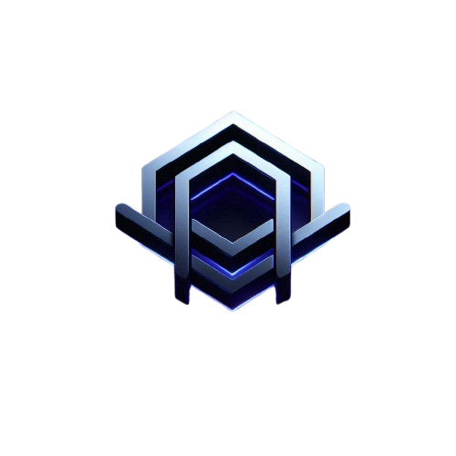

.png)

<h1 align="center">👋 Hi, I'm Omar Hassan</h1>

  
  

  🎓 <b>Business Information Systems Student</b> | 💻 <b>Full-Stack Developer</b> 
  🧭 <i>Transforming business strategy into software innovation.</i> 
  📍 Cairo, Egypt | 📧 <a href="mailto:omar.h.elkady@hotmail.com">omar.h.elkady@hotmail.com</a>

  
  
  

  

---

## 🧠 About Me

💡 Business-savvy full-stack developer passionate about **fintech, digital transformation, and data-driven innovation**.  
📊 Bridging the gap between **business intelligence and software engineering** to deliver measurable outcomes.  
⚙️ I love building systems that help **organizations make smarter, faster, data-informed decisions**.  

🎯 Maintaining a **3.96 GPA** at AAST — thriving at the intersection of **business insight, analytics, and code**.  
💼 Open to opportunities in **Digital Banking**, **Data Strategy**, and **Tech-Driven Consulting**.  
☕ Fueled by espresso and a relentless pursuit of efficiency.

---

## 💼 Experience Timeline

| 🗓️ Period | 🏢 Organization | 💼 Role | 🔍 Focus |
|------------|----------------|---------|----------|
| 2024–2025 | 🏦 **CIB Egypt** | Internship Trainee | Supported *Future Vest: The Green Leap* program; optimized workflows for digital banking projects. |
| 2024 | 🏛️ **Abu Dhabi Commercial Bank (ADCB)** | Summer Intern | Researched automation and process digitization within the banking sector. |
| 2023 | 💻 **IctHub Egypt** | Python Intern | Delivered real-world Python automation projects — rated **Excellent** for performance and code quality. |

---

## 🎓 Education

🎓 **Bachelor’s in Business Information Systems**  
Arab Academy for Science, Technology & Maritime Transport (AAST)  
📅 *2022–2026* | 📈 *GPA: 3.96 / 4.0 (Excellent)*  

---

## ⚙️ Tech Stack

### 🖥️ Frontend Development

   
  HTML • CSS • Tailwind • Bootstrap • JavaScript • React

### ⚙️ Backend & Data

   
  Node.js • Express • Python • PHP • MySQL

### 🧰 Tools & Collaboration

   
  Git • GitHub • VSCode • Figma • Postman

---

## 🌟 Highlights & Impact

✅ Built a **Banking API Simulation** — RESTful endpoints handling secure, real-world transaction flows.  
✅ Designed an **Interactive BI Dashboard** integrating **Python + Tableau + Excel** for real-time KPIs.  
✅ Delivered automation scripts improving **process accuracy by 30%** during internship tasks.  
✅ Recognized with **Academic Excellence Awards (2024, 2025)** at AAST.  
✅ Collaborated on a **Green Banking Initiative** under CIB’s Future Vest program.  
✅ Continuously exploring **AI, Blockchain, and Cybersecurity** for data-driven business systems.

---

## 📜 Certifications Snapshot

| 🧠 Category | 🏅 Certifications |
|-------------|------------------|
| **Data & Tech** | SAS Data Literacy • Tableau BI (CFI) • Python (ITI) • Blockchain (EYouth) • CCNA (Cisco) • HP Cybersecurity |
| **Banking & Finance** | SAS & CIB Digital Transformation • EBI Credit & Business Planning • LinkedIn Entrepreneurial Skills |
| **Professional Skills** | Frankfurt School – Human-Centric Skills • HP LIFE – Effective Presentations • ALX Africa – AI Skills |

---

## 🚀 Featured Projects

| 🌐 Project | 💡 Description | 🧩 Tech |
|------------|----------------|--------|
| [📦 **Portfolio Website**](https://github.com/omarel-kady/portfolio) | Personal site highlighting projects, experience, and design philosophy | React • Tailwind CSS |
| [💰 **Bank API**](https://github.com/omarel-kady/bank-api) | RESTful API simulating real-world banking operations | Node.js • Express • MySQL |
| [📊 **Data Dashboard**](https://github.com/omarel-kady/data-dashboard) | BI dashboard with interactive data visualizations & KPIs | Python • Tableau • Excel |

---

## 🧭 Currently Exploring

🌐 Digital Banking & Fintech Architecture  
📊 Data-Driven Decision Systems  
🧠 Business Analytics with AI  
🔐 Blockchain & Secure Transactions  

---

## 🏅 Awards & Recognition

🏆 Certificate of Academic Excellence – AAST (2024, 2025)  
🌱 Finalist – *Future Vest: The Green Leap* Innovation Challenge  
💡 Recognized for delivering high-impact analytics solutions during internship rotations  

---

## 🤝 Connect with Me

  
  
  

---

✨ <i>"Turning ideas into impact through code and creativity."</i> ✨

